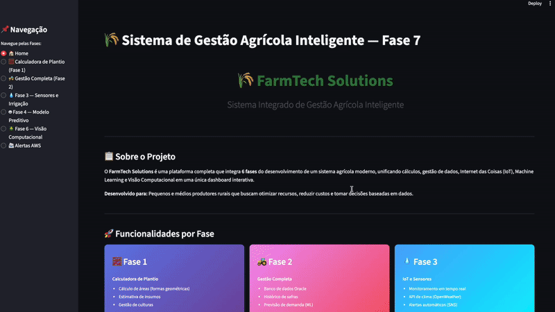
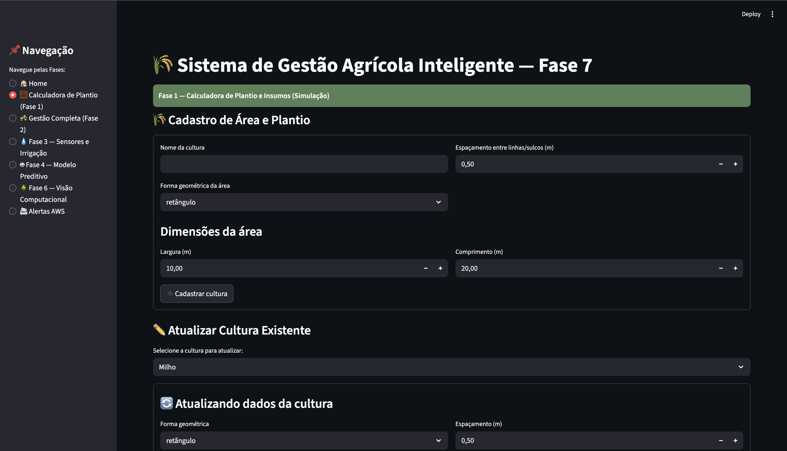
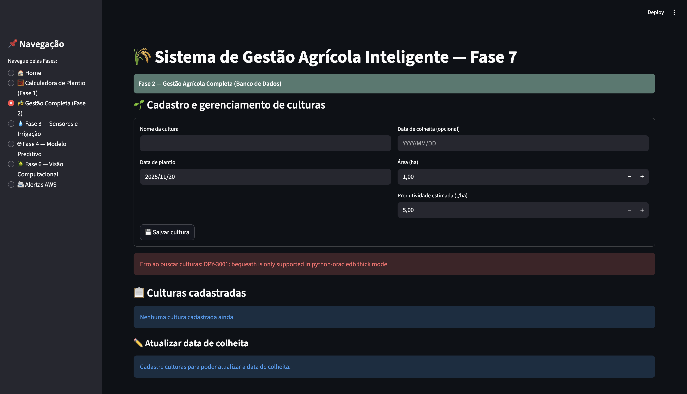
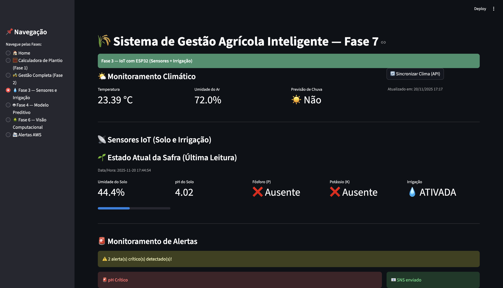
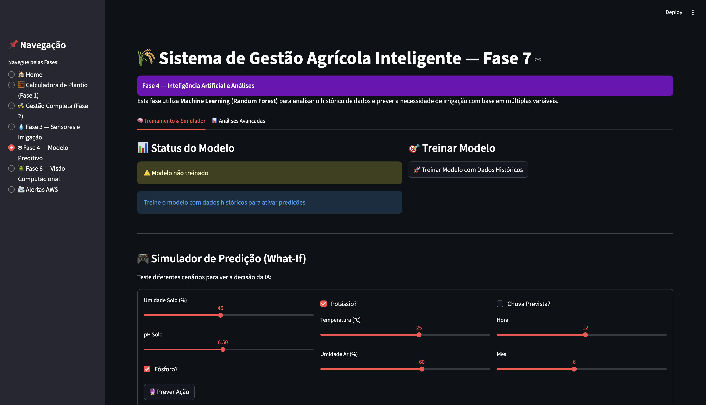
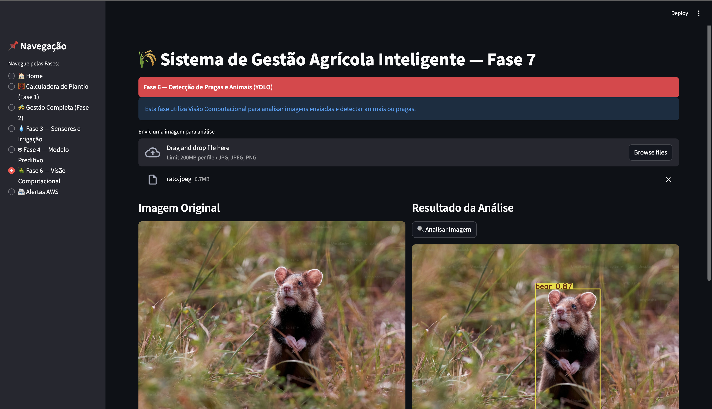
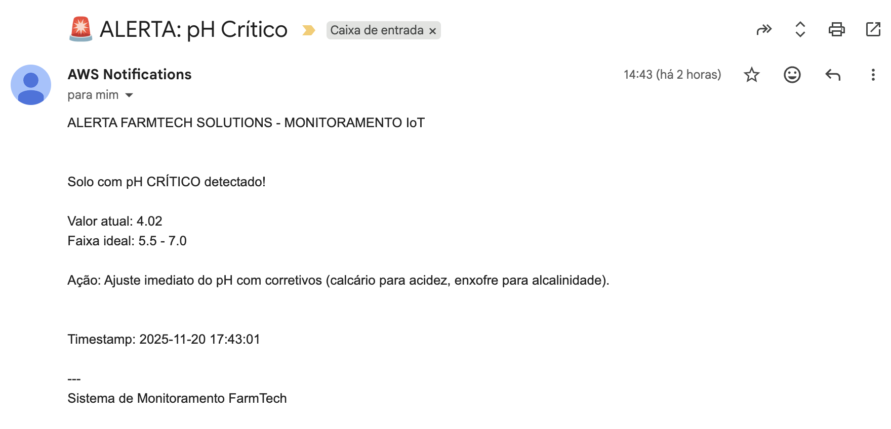
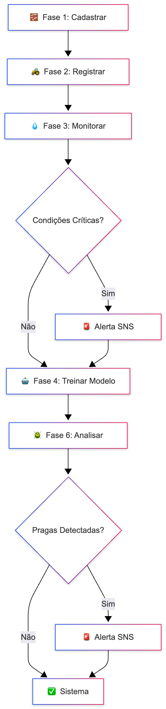

# FIAP - Faculdade de Informática e Administração Paulista

<p align="center">
<a href= "https://www.fiap.com.br/"></a>
</p>

<br>

# FarmTech Solutions - Sistema Integrado de Gestão Agrícola

## Nome do grupo
Grupo 24

## 👨‍🎓 Integrantes
- <a href="https://www.linkedin.com/in/anacornachi/">Ana Cornachi</a>
- <a href="https://www.linkedin.com/in/carlamaximo/">Carla Máximo</a>

## 👩‍🏫 Professores
### Tutor(a) 
- <a href="https://www.linkedin.com/in/lucas-gomes-moreira-15a8452a/">Lucas Gomes Moreira</a>
### Coordenador(a)
- <a href="https://www.linkedin.com/in/andregodoichiovato/">André Godoi Chiovato</a>

---

## 📜 Descrição do Projeto (PBL - Problem Based Learning)

### O Problema

O agronegócio brasileiro enfrenta desafios crescentes relacionados à eficiência operacional, sustentabilidade e tomada de decisões baseadas em dados. Pequenos e médios produtores rurais frequentemente lidam com:

1. **Desperdício de Recursos:** Irrigação excessiva ou insuficiente devido à falta de monitoramento preciso do solo
2. **Perdas por Pragas:** Detecção tardia de animais invasores que danificam plantações
3. **Planejamento Ineficiente:** Dificuldade em calcular áreas de plantio e demandas de insumos
4. **Fragmentação de Dados:** Informações dispersas em planilhas, sistemas isolados e anotações manuais
5. **Falta de Alertas Preventivos:** Ausência de notificações sobre condições críticas que exigem ação imediata

Esses problemas resultam em custos elevados, redução de produtividade e impactos ambientais negativos, como uso excessivo de água e agroquímicos.

### A Solução

O **FarmTech Solutions** é um sistema integrado desenvolvido ao longo de seis fases do PBL, consolidando ferramentas de cálculo, gestão de dados, IoT, inteligência artificial e alertas automatizados em uma **única dashboard interativa** construída com **Streamlit**. 

O sistema permite que o produtor:
- Calcule áreas de plantio e estime quantidades de insumos com base em formas geométricas reais do terreno
- Gerencie culturas e histórico de aplicações em um banco de dados Oracle
- Monitore sensores IoT simulados que medem umidade do solo, pH, fósforo e potássio
- Sincronize dados climáticos em tempo real via API OpenWeatherMap
- Treine modelos de Machine Learning para prever necessidades de irrigação
- Detecte pragas em imagens usando Visão Computacional (YOLO)
- Receba alertas automáticos via AWS SNS quando condições críticas ou pragas são identificadas

### Objetivos de Aprendizagem

Este projeto integra conceitos de:
- **Engenharia de Software:** arquitetura modular, integração de sistemas, versionamento Git
- **Banco de Dados:** modelagem relacional, ORM SQLAlchemy, operações CRUD
- **IoT e Automação:** sensores simulados, digital twins, integração com ESP32 (conceitual)
- **Cloud Computing:** serviços AWS (SNS), análise de custos, infraestrutura na nuvem
- **Ciência de Dados:** análise exploratória, clusterização, modelos preditivos
- **Inteligência Artificial:** Random Forest para irrigação, YOLO para detecção de objetos
- **Design de Experiência:** interface intuitiva, visualizações interativas com Plotly

A metodologia PBL garantiu que cada fase do projeto respondesse a uma necessidade prática da fazenda, culminando em um produto final robusto e escalável que pode ser adaptado para diferentes culturas e regiões.

### 🎥 Demonstração do Sistema




---

## 🎯 O Que Foi Desenvolvido em Cada Fase

### **Fase 1: Calculadora de Plantio** 🧮
**Problema:** Como calcular áreas e insumos para terrenos de formato irregular?

**Solução:** Sistema de cálculo baseado em formas geométricas (retângulo, círculo, triângulo) que:
- Calcula área total, área útil de cultivo e área de sulcos/carreadores
- Determina número de linhas com base no espaçamento entre plantas
- Estima quantidade total de insumos (kg, litros, unidades) por área

**No Streamlit:** Aba dedicada com formulários para cadastro de culturas e insumos, exibição de métricas calculadas e CRUD completo.



---

### **Fase 2: Gestão Completa com Banco de Dados** 🚜
**Problema:** Como armazenar histórico de safras e previsões de demanda?

**Solução:** Integração com Oracle Database para:
- Persistir culturas, insumos e aplicações
- Gerar previsões de demanda usando Regressão Linear (scikit-learn)
- Visualizar histórico de safras e custos

**No Streamlit:** Aba com acesso ao banco, consultas SQL via repositórios, gráficos de tendências e sistema de forecast.

**Melhorias:** Todas as operações CRUD foram mantidas da fase original. Corrigido bug de emoji corrompido que impedia renderização.



---

### **Fase 3: IoT e Sensores Inteligentes** 💧
**Problema:** Como monitorar condições do solo em tempo real e tomar decisões de irrigação?

**Solução:** Sistema IoT simulado com:
- Leitura de sensores (umidade, pH, fósforo, potássio)
- Integração com OpenWeatherMap API para dados climáticos reais
- Lógica de decisão automática de irrigação
- **Digital Twin:** Simulador que permite gerar leituras manualmente

**No Streamlit:** 
- Exibição de métricas em tempo real (gauges, progresso)
- Gráficos históricos de tendências
- Botão "Sincronizar Clima" para buscar dados da API
- **Sistema de Alertas:** Monitora 5 condições críticas:
  1. pH fora da faixa ideal (5.5-7.0)
  2. Seca severa (umidade < 20%)
  3. Encharcamento (umidade > 80%)
  4. Deficiência nutricional (P e K ausentes)
  5. Falha no sistema de irrigação

**Priorizado:** API de clima real e alertas automáticos via SNS.



---

### **Fase 4: Machine Learning e Análises Avançadas** 🤖
**Problema:** Como prever a necessidade de irrigação com base em múltiplas variáveis?

**Solução:** Modelo de **Random Forest** treinado com dados históricos de sensores e clima.

**No Streamlit:**
- Interface de treinamento com métricas de acurácia
- Gráfico de importância das features (Plotly)
- **Simulador "What-If":** Permite testar cenários com sliders interativos
- Análises avançadas:
  - Matriz de correlação entre variáveis
  - Gráficos de dispersão por status de irrigação
  - Padrões históricos

**Mantido:** Toda a lógica de ML da fase original foi preservada e aprimorada com visualizações.



---

### **Fase 5: Cloud Computing e Análise de Custos** ☁️
**Nota:** Esta fase foi focada em **análise de custos AWS** e **ciência de dados** (Jupyter Notebook). Não foi integrada ao Streamlit pois consiste em documentação e análises estáticas.

**Conteúdo:** Comparação de preços AWS (N. Virgínia vs. São Paulo), estimativa de custos para hospedar o sistema, análise de dataset de safras com K-Means e modelos de regressão.

---

### **Fase 6: Visão Computacional para Detecção de Pragas** 🪲
**Problema:** Como identificar animais invasores (pássaros, roedores) que danificam a safra?

**Solução:** Detecção de objetos usando **YOLOv8** (Ultralytics).

**No Streamlit:**
- Upload de imagens (JPG/PNG)
- Análise com YOLO e exibição da imagem anotada
- Listagem de objetos detectados com scores de confiança
- **Alertas Automáticos:** Quando animais são detectados, SNS é disparado imediatamente

**Classes de Interesse:** `bird`, `cat`, `dog`, `mouse`, `rat`, `sheep`, `cow`



---

## 🚨 Sistema de Alertas AWS SNS (Automático)

**Infraestrutura:** Serviço criado (`aws_sns_service.py`) integrado com **Amazon SNS**.

**Alertas Automáticos Implementados:**
1. **Fase 3 (Sensores):** Monitora continuamente 5 condições críticas e dispara alertas automáticos quando detectadas:
   - pH crítico (< 5.5 ou > 7.0)
   - Seca severa (umidade < 20%)
   - Encharcamento (umidade > 80%)
   - Deficiência nutricional (P e K ausentes)
   - Falha na irrigação
2. **Fase 6 (Pragas):** Detecta animais em imagens e dispara alerta imediato com lista de espécies detectadas

**Como Funciona:**
- **Fase 3:** A cada nova leitura de sensor, o sistema verifica automaticamente as condições e envia SNS se necessário
- **Fase 6:** Ao analisar uma imagem, se animais forem detectados, o alerta é enviado instantaneamente

**Mensagens de Alerta Incluem:**
- Descrição do problema
- Valores críticos detectados
- Ações recomendadas (ex: "Ativar irrigação urgente", "Verificar local para evitar danos")

**Configuração:** Via variáveis de ambiente (`.env`). Sistema funciona mesmo sem AWS configurado (degradação graciosa).



---

## 🛠️ Tecnologias Utilizadas

- **Frontend:** Streamlit, Plotly (gráficos interativos)
- **Backend:** Python 3.10+
- **Banco de Dados:** Oracle Database (via SQLAlchemy ORM)
- **Machine Learning:** Scikit-learn (Random Forest, Linear Regression)
- **Visão Computacional:** Ultralytics YOLOv8, OpenCV, PIL
- **Cloud:** AWS SNS (alertas), Boto3 (SDK Python)
- **APIs Externas:** OpenWeatherMap (dados climáticos)
- **Controle de Versão:** Git/GitHub

---

## 🚀 Como Executar o Projeto

### Pré-requisitos

- Python 3.10 ou superior
- Oracle Database configurado (ou acesso à instância Oracle Cloud)
- Conta AWS (opcional, para alertas SNS)
- API Key do OpenWeatherMap (opcional, para clima real)

### Passo 1: Clonar o Repositório

```bash
git clone https://github.com/anacornachi/grupo-24.git
cd grupo-24
```

### Passo 2: Criar Ambiente Virtual

```bash
# No macOS/Linux
python3 -m venv .venv
source .venv/bin/activate

# No Windows
python -m venv .venv
.venv\Scripts\activate
```

### Passo 3: Instalar Dependências

```bash
pip install -r requirements.txt
```

**Dependências principais:**
- streamlit
- pandas
- numpy
- plotly
- sqlalchemy
- oracledb
- scikit-learn
- ultralytics
- opencv-python
- boto3
- requests

### Passo 4: Configurar Variáveis de Ambiente

Crie um arquivo `.env` na raiz do projeto com o seguinte conteúdo:

```env
# Oracle Database
ORACLE_USER=seu_usuario
ORACLE_PASSWORD=sua_senha
ORACLE_HOST=seu_host.oraclecloud.com
ORACLE_PORT=1521
ORACLE_SERVICE_NAME=seu_service_name

# OpenWeatherMap API (Fase 3)
OPEN_WEATHER_API_KEY=sua_chave_aqui
OPEN_WEATHER_CITY=Sao Paulo

# AWS SNS (Alertas)
AWS_ACCESS_KEY_ID=sua_access_key
AWS_SECRET_ACCESS_KEY=sua_secret_key
AWS_REGION=us-east-1
AWS_SNS_TOPIC_ARN=seutopicoarn
```

**Observações:**
- As credenciais AWS e OpenWeatherMap são **opcionais**. Sem elas, o sistema funciona normalmente mas não envia alertas nem busca clima real.
- Para AWS SNS: você precisa criar um tópico SNS no console AWS e assinar com seu e-mail/telefone.

### Passo 5: Inicializar o Banco de Dados (Fase 3)

Execute os scripts de setup apenas na primeira vez:

```bash
# Criar tabelas
PYTHONPATH=src/fase3/src/python ./.venv/bin/python src/fase3/src/python/database/setup.py

# Popular com dados iniciais
PYTHONPATH=src/fase3/src/python ./.venv/bin/python src/fase3/src/python/database/seed.py
```

### Passo 6: Executar a Dashboard

```bash
streamlit run src/final/dashboard.py
```

A aplicação será aberta automaticamente no navegador em `http://localhost:8501`.


---

## 📂 Estrutura do Projeto

```
byte-08/
├── src/
│   ├── final/
│   │   ├── dashboard.py          # Aplicação principal Streamlit
│   │   └── aws_sns_service.py    # Serviço de alertas AWS
│   ├── fase1/                    # Calculadora de plantio
│   ├── fase2/                    # Gestão com banco de dados
│   ├── fase3/                    # IoT e sensores
│   ├── fase4/                    # Machine Learning
│   ├── fase5/                    # Análise de custos AWS
│   └── fase6/                    # Visão computacional
├── assets/                       # Imagens e recursos estáticos
├── .env                          # Variáveis de ambiente (não versionado)
├── requirements.txt              # Dependências Python
└── README.md                     # Este arquivo
```

---

## 🎯 Funcionalidades por Aba

| Aba | Funcionalidade | Status |
|-----|----------------|--------|
| 🏠 Home | Visão geral do sistema | ✅ |
| 🧮 Fase 1 | Calculadora de plantio e CRUD culturas | ✅ |
| 🚜 Fase 2 | Gestão completa e forecast | ✅ |
| 💧 Fase 3 | IoT, clima API, alertas sensores | ✅ |
| 🤖 Fase 4 | ML, treinamento, simulador | ✅ |
| 🪲 Fase 6 | YOLO, detecção de pragas, alertas | ✅ |

---

## 📊 Demonstração

### Fluxo de Uso Típico

1. **Planejamento (Fase 1):** Cadastrar cultura, definir área e forma geométrica
2. **Gestão (Fase 2):** Registrar aplicações de insumos, consultar histórico
3. **Monitoramento (Fase 3):** Simular leitura de sensor ou sincronizar clima real
4. **Alertas (Fase 3):** Receber SMS/e-mail se pH estiver crítico
5. **Predição (Fase 4):** Treinar modelo e simular cenários de irrigação
6. **Inspeção (Fase 6):** Fazer upload de foto da plantação, detectar pássaros, receber alerta



---

## Video da entrega

[Video](https://youtu.be/xTZI9__5S80)
---

## 🗃 Histórico de Lançamentos

* **0.4.0 - 20/11/2024** - Alertas Inteligentes e Melhorias na Visão Computacional
  * **Sistema de Alertas SNS Aprimorado:**
    * Implementado controle de sessão para evitar envios duplicados de alertas
    * Alertas agora são enviados apenas uma vez por condição crítica
    * Feedback visual claro ("📧 SNS enviado" vs "✅ Já enviado")
    * Reset automático quando condições voltam ao normal
  * **Fase 6 - Visão Computacional:**
    * Atualizado para modelo YOLOv8 Large (maior precisão)
    * Implementado threshold de confiança de 70% para reduzir falsos positivos
    * Melhor tratamento de erros e importações tardias
  * **Dashboard:**
    * Removida aba "Alertas AWS" (alertas agora são 100% automáticos)
    * Limpeza de código legado e otimização de imports
    * Home page profissional com cards coloridos para cada fase
  * **Documentação:**
    * README atualizado
  * **Bug Fixes:**
    * Corrigido simulador IoT da Fase 3 (adicionado sensor_id obrigatório)
    * Tratamento adequado de numpy arrays em condicionais booleanas
  
* **0.3.0 - 20/11/2024** - Dashboard Unificado Completo
  * Integração total das Fases 1-6 em produção
  * Fase 3: API OpenWeatherMap + alertas automáticos de sensores
  * Fase 4: Random Forest + análises avançadas + simulador ML
  * Fase 6: YOLOv8 para detecção de pragas + alertas automáticos
  * AWS SNS: sistema de alertas inteligente (pragas + sensores críticos)
  * Adicionado Plotly para visualizações interativas
  
* **0.2.0 - 20/11/2024** - Integração da Fase 1
  * CRUD completo de culturas
  * Cálculos de área e insumos funcionais
  
* **0.1.0 - 13/11/2024** - Versão Inicial
  * Dashboard mockada com todas as abas
  * Estrutura base para integração

---

## 📋 Licença

<p xmlns:cc="http://creativecommons.org/ns#" xmlns:dct="http://purl.org/dc/terms/"><a property="dct:title" rel="cc:attributionURL" href="https://github.com/agodoi/template">MODELO GIT FIAP</a> por <a rel="cc:attributionURL dct:creator" property="cc:attributionName" href="https://fiap.com.br">Fiap</a> está licenciado sobre <a href="http://creativecommons.org/licenses/by/4.0/?ref=chooser-v1" target="_blank" rel="license noopener noreferrer" style="display:inline-block;">Attribution 4.0 International</a>.</p>
